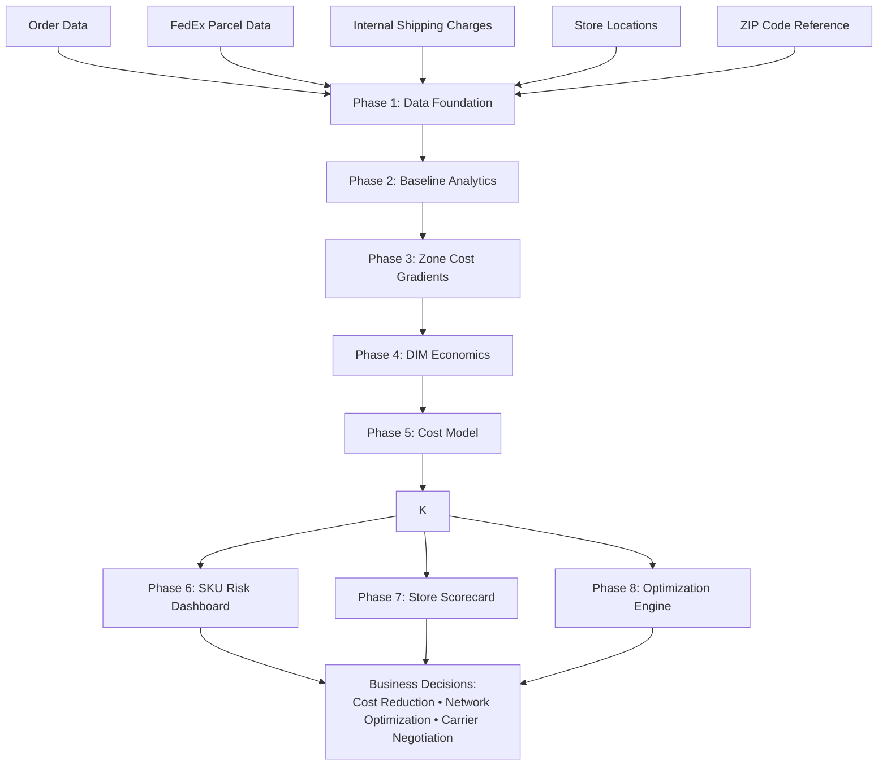

# Shipping Cost Optimization & Logistics Analytics Engine

This project builds a **data-driven logistics analytics and optimization engine** designed to analyze, explain, and reduce parcel shipping costs across a multi-store fulfillment network.

The system integrates order data, carrier invoices, geographic data, and dimensional shipment attributes to:

• Quantify **true cost drivers**  
• Identify **operational inefficiencies**  
• Simulate **optimal fulfillment strategies**  

The workflow progresses from **descriptive analytics → predictive modeling → optimization**, enabling data-driven logistics decisions.

---

## Key Objectives

The project answers several operational and strategic logistics questions:

• **Shipping Cost Drivers:** What factors most influence parcel shipping cost?  

• **Distance Impact:** How do zone distance and service level affect shipping spend?  

• **DIM Exposure:** Which stores generate the highest dimensional shipping charges?  

• **SKU Cost Risk:** Which products disproportionately drive logistics cost?  

• **Store Efficiency:** Which stores operate most efficiently?  

• **Fulfillment Optimization:** What is the optimal origin store for each order?  

• **Network Savings:** How much shipping cost reduction is possible through smarter routing?  

---

# Pipeline Architecture

# Analytical Pipeline  

The analysis is implemented as an 8-phase pipeline:  

---

## Phase 1 — Empirical Shipping Cost Foundation  

Builds a unified, shipment-level dataset by merging operational sources.  

**Data sources include:**  

• Order fulfillment data	  
• Carrier parcel invoices	  
• Internal shipping tracking data  	  
• Store location coordinates	  
• U.S. ZIP code geolocation data  	

**Key outputs:**  

• Master dataset (master)  
• Pricing zone, weight, and volume features  
• DIM flag (dimensional shipment indicator)  
• Revenue attribution and margin proxy  
• Shipping cost as % of revenue  

---

## Phase 2 — Descriptive Baseline Analysis  

Establishes a pre-negotiation shipping cost baseline.  

### **Key metrics generated:**  

• Total shipping spend  
• Shipping cost per order and per shipment  
• Shipping cost as a percentage of revenue  
• Service-level mix analysis  
• Zone distribution analysis  
• Store-level performance  

---

## Phase 3 — Store-Specific Zone Cost Gradients  

Analyzes how shipping cost increases with distance (zone) for each store.  

### **Key metrics:**  

**• Avg_Weight**  - Average shipment weight  

High → heavier shipments → higher cost exposure  
Low → lighter, more efficient shipments  

**• Avg_Volume**  - Average package size (cubic inches)  

High → higher likelihood of DIM charges  
Low → efficient packaging  

**Outputs include:**  

Store × Zone cost tables  
Incremental $ per zone increase  
Cost per pound analysis  
Zone cost heatmaps  

---

## Phase 4 — Dimensional Shipping Economics  

Examines the financial impact of dimensional weight pricing.  

### **Key metrics:**  

**• Overall_DIM_Rate**  - % of shipments with DIM charges  
High → widespread packaging inefficiency  

**• DIM_Rate**  - DIM exposure by store or SKU  

**• Weight_Band**  - Grouping of shipments by weight  

**• No_DIM_Avg vs DIM_Avg**  - Cost comparison with vs without DIM  

**• DIM_Premium_$**  - Additional cost caused by DIM  
High → major cost savings opportunity  

**• Avg_Weight_Variance**  - Difference between actual vs billed weight  

**• Underreported_Rate**  - % of shipments underreported  
High → compliance issues  

**• Volume_Band**  - Shipment size segmentation  

**• Volume_Slope_Cost_per_Cubic_IN**  - Cost increase per cubic inch  
High → carriers heavily penalize size  

---

## Phase 5 — Feature Importance Model

Builds a linear regression model to quantify shipping cost drivers.

**Model outputs:**  

**• R²**  - % of cost explained by the model  

**• MAE_$**  - Average prediction error in dollars  

**• Model_Intercept_$**  - Base cost before variables  

**• Coefficient_$**  - Dollar impact per variable  

**• Std_Coefficient**  - Standardized importance  

**• Abs_Contribution**  - Magnitude of impact  

**• Percent_Contribution**  - % share of each driver  

**Feature**  
Input variable (weight, zone, distance, etc.)  

---

## Phase 6 — SKU Shipping Risk Dashboard  
Identifies products that disproportionately drive shipping cost.  

### **Key metrics:**

**• Avg_Zone**  - Average shipping distance  

**• Shipping_to_Revenue_%**  - Shipping cost as % of product revenue  

**• Risk_Category**

**High Risk**  
High DIM + high cost %  
Significant margin erosion  
Requires packaging or pricing changes  

**Medium Risk**  
Moderate inefficiency  
Optimization opportunity  

**Low Risk**  
Operationally efficient  
Minimal concern  

---

## Phase 7 — Store Performance Scorecard

Measures fulfillment efficiency across stores.

### **Key metrics:**

**• Weight_Variance_Risk**  - Variability in shipment weight

**• Volume_Variance_Risk**  - Variability in package size

**• Performance_Score**

Performance Score =
    40% DIM efficiency +
    40% cost efficiency +
    20% operational consistency

High score → efficient, consistent store		  
Low score → operational improvement needed  

---

## Phase 8 — Origin Optimization Engine

Simulates the optimal fulfillment store for each order.

**For each order, the engine:**

**1.** Calculates distance from every store		  
**2.** Converts distance to shipping zone		  
**3.** Applies regression-based cost model		  
**4.** Adds DIM penalties		  
**5.** Selects lowest-cost origin  		

**Outputs include:**

Predicted cost for each store-order combination		  
Optimal origin selection		  
Estimated savings vs actual		  

---

# The Big Picture

This is not just a reporting tool — it is a **decision engine.**

It provides:

**• Visibility** → Where shipping cost comes from  
**• Diagnosis** → What is causing inefficiency  
**• Quantification** → Dollar impact of each driver  
**• Optimization** → What should have happened  

**In simple terms:**

This model explains why shipping is expensive, identifies where it is broken, and shows how to fix it with measurable savings.

---

# Technologies Used

• pandas — data manipulation  
• numpy — numerical computation  
• scikit-learn — regression modeling  
• xlsxwriter — Excel reporting  
• Haversine formula — geospatial distance  

---

# Output Deliverables

The script generates Excel reports including:

• Shipping baseline analysis  
• Store performance dashboards  
• SKU risk tables  
• DIM impact analysis  
• Feature importance outputs  
• Optimization simulation  

---

# Use Cases

• Carrier rate negotiations  
• Fulfillment network design  
• Packaging optimization  
• Store performance management  
• SKU profitability analysis  
• Logistics cost reduction  

---

# Future Enhancements

• Machine learning models (Random Forest, XGBoost)  
• Real carrier zone mapping  
• Dynamic routing optimization  
• Inventory-aware fulfillment  
• Interactive dashboards (Power BI / Tableau)  
• API integrations  
